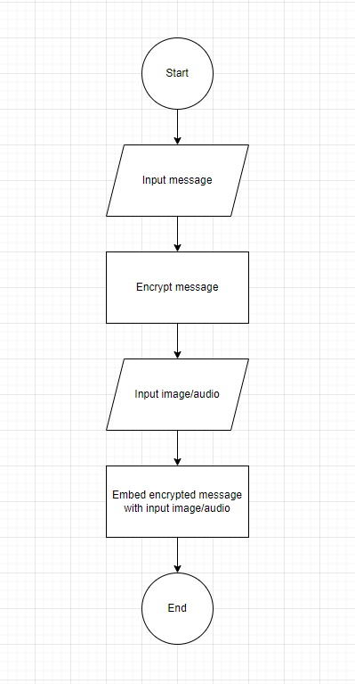
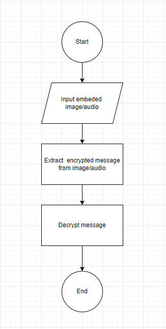
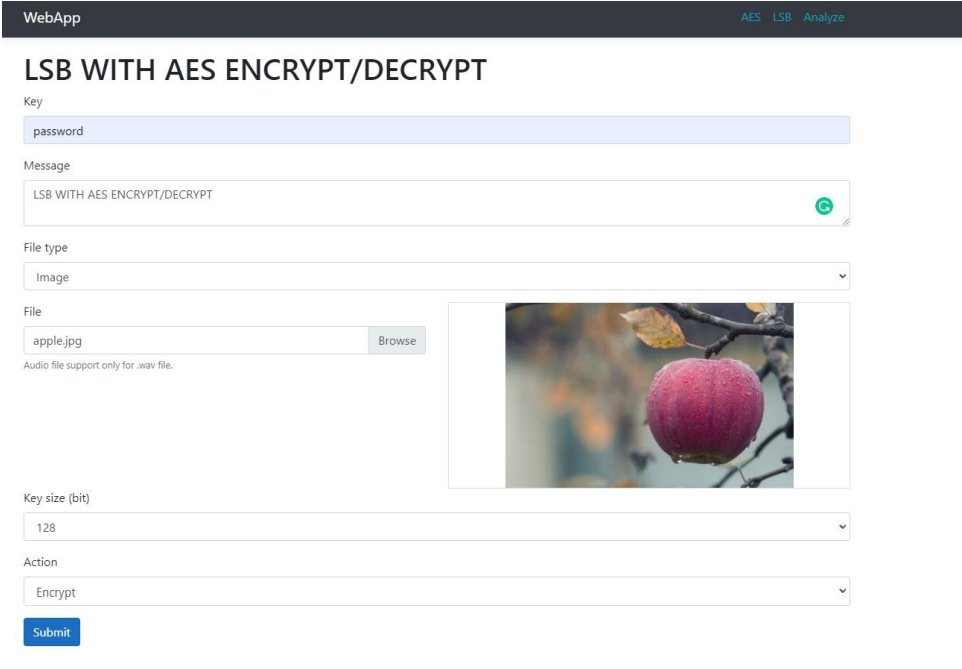
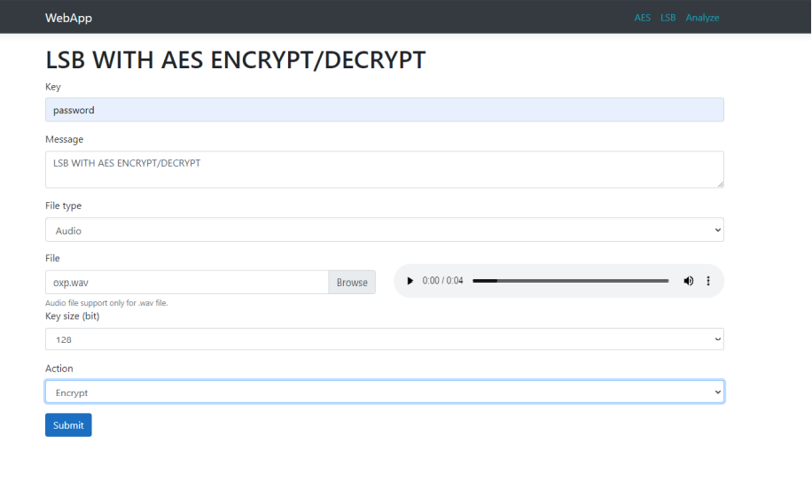
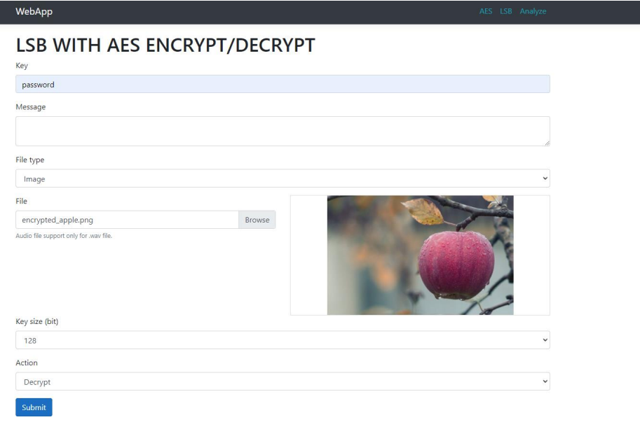

# LSB with AES

## Table of Contents

- [General](#general)
- [Technologies used](#technologies-used)
- [Algorithms](#algorithms)
- [Structure](#structure)
- [Features](#features)
- [Screenshots](#screenchots)
- [Setup](#setup)
- [Usage](#usage)
- [Room for improvement](#room-for-improvement)
- [Ackownledgments](#acknowlegdments)

## General

- Build a cryptography tools for encrypt, decrypt message and embed, extract encrypted messsage into image and audio.

## Technologies used

- .NET 5.0
- ReactJS

## Algorithms

- Advanced Encryption Standard (AES) is used for message encrypt and decrypt.
- Least Significant Bit (LSB) is used for embed encrypted message into image and audio.

## Structure

- Process encrypt message and embed encrypted message into image/audio. 
- Process decrypt messsage and extract encrypted message from embeded image/audio. 

## Features

- Encrypt and decrypt message.
- Embed and extract data from image/audio.
- Compare data from original image/audio to embeded image/audio

## Screenshots

- Main page message encrypt and embed image .
- Main page message encrypt and embed audio .
- Main page message decrypt and extract image .
- Analyze 

## Setup

- I only run on Visual studio 2019. You can import project to Visual studio 2019 to run.
- Install NPM from Node.js

## Usage

- User input image/audio and message to Webapp and submit data. Webapp will return result to user .

## Room for improvement

- Algorithms have not completed to match these requirements:
  - Can not be detected by any machine or human:
    - With image normal human eyes can not detect changes after embeded but i have not tested with any detection algorithms.
    - With audio normal human ears can detect changes after embeded with large data.
    - <mark>This weakeness can be prevented by spreading data into random position in image/audio.</mark>
  - Robust:
    - AES algorithm need precisely data to decypt if any changes in the encrypted data will make result not same as original.
    - <mark>Use Discrete wavelet transform (DWT) or Discrete cosine transform (DCT) to make this changes less effect to the data.</mark>

## Ackownledgments

- https://www.researchgate.net/publication/334670533_A_LSB_and_256-bit_Key_AES_based_EncryptionDecryption_Process_for_Secured_Steganography_Data_Transactions
- https://www.researchgate.net/figure/Encryption-Decryption-Process_fig1_286744163
- https://www.researchgate.net/publication/266488076_A_Survey_on_Steganography_Techniques_in_Real_Time_Audio_Signals_and_Evaluation
- https://www.researchgate.net/publication/312864286_Development_of_Requirements_Specification_for_Steganographic_Systems
- http://soundfile.sapp.org/doc/WaveFormat/
- http://lib.uet.vnu.edu.vn/bitstream/123456789/904/1/LUAN%20VAN%20TDL%20MMT.pdf
- https://www.researchgate.net/publication/262217374_Audio_steganography_using_LSB_encoding_technique_with_increased_capacity_and_bit_error_rate_optimization
